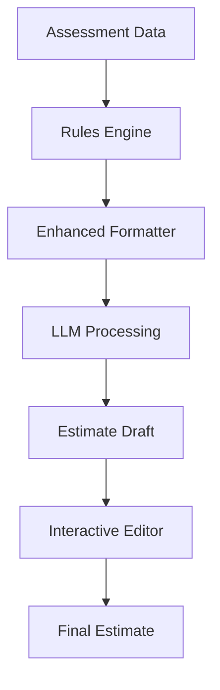
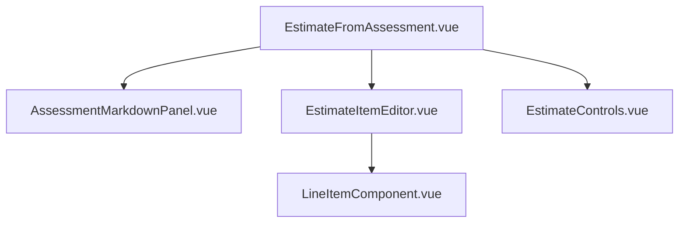

# Assessment-to-Estimate Integration Guide

## Overview

This guide outlines the enhanced workflow for transforming project assessments directly into detailed estimates using LLM assistance. The system leverages structured assessment data (measurements, materials, and conditions) to generate accurate and transparent estimates without focusing on catalog service creation.

## System Architecture

### Data Flow Architecture



### Key Components

1. **Assessment Data**: Raw inspection data from projects (measurements, materials, conditions)
2. **Rules Engine**: Pre-processes data to identify replacement needs based on business logic
3. **Enhanced Formatter**: Structures data for optimal LLM comprehension
4. **LLM Processing**: Analyzes formatted assessment data to generate line items
5. **Estimate Draft**: Initial estimate created from LLM analysis
6. **Interactive Editor**: Split-screen interface showing assessment data and estimate items with bidirectional linking
7. **Final Estimate**: User-approved estimate ready for client presentation

## Assessment Data Structure

The system uses a specialized markdown-like format for structuring assessment data that enables the LLM to accurately interpret the information. The enhanced measurement system now supports three different calculation methods:

1. **Area-based (sq ft)**: For surfaces like walls, ceilings, floors, and roofs
2. **Linear-based (ln ft)**: For trim, molding, fascia, gutters, and bracing
3. **Quantity-based (count)**: For fixtures, disposal items, and discrete components

```markdown
## ASSESSMENT DATA

### Metadata
- Date: 2025-04-12
- Inspector: Jane Doe
- Project ID: 1234

### Scope
Replace damaged exterior siding and trim on north and south walls.

### MEASUREMENTS
#### Area Measurements (sq ft)
- South Wall Area: 240 sq ft → REPLACE: Fiber Cement Siding
- North Wall Area: 180 sq ft → REPLACE: Fiber Cement Siding

#### Linear Measurements (ln ft)
- Fascia Length (Front): 48 ln ft → REPLACE: PVC Fascia Board
- Window Trim (West): 28 ln ft → REPLACE: Composite Trim
- Corner Trim: 32 ln ft → REPLACE: PVC Corner Trim

#### Quantity Measurements (count)
- Disposal: 2 dumpster loads → INCLUDE: Waste Removal
- Fixtures: 4 light fixtures → REMOVE and REINSTALL

### MATERIALS
- Siding Type: Fiber Cement, 8.25"
- Paint Color: Arctic White
- Fasteners: Galvanized nails, ring shank

### CONDITIONS
- North Wall: Rot Detected (Moderate) → REPAIR: Substrate
- South Wall: Peeling Paint (Severe) → TREAT: Primer before paint
- Fascia: Mold Presence (Mild) → CLEAN before installation

### REPLACEMENT INDICATORS
- All measured surfaces flagged for replacement
- Rot present → substrate repair needed
- Severe peeling → additional prep time

### NOTES
Client requests expedited work due to HOA deadline. Access limited on west side.
```

## Rules Engine Logic

The rules engine automatically tags assessment data with recommended actions based on measurements and conditions. It follows these core principles:

1. **Measurement-Based Inference**: Presence of measurements generally indicates replacement needs
2. **Condition-Based Modifiers**: Conditions influence preparation work and additional services
3. **Severity-Based Decisions**: Condition severity determines approach (repair vs. replace)

### Example Rules

- If Area > 50 sq ft → Tag for replacement
- If Linear Length > 20 ft → Tag for replacement
- If Rot present && Severity >= Moderate → Add substrate repair
- If Mold present → Add cleaning service
- If Location matches between measurement and condition → Link condition modifier to measurement

## LLM Prompt Enhancement

The LLM receives structured assessment data and processes it according to these instructions:

```plaintext
You are a professional construction estimator specializing in creating accurate estimates from field assessments.

TASK:
Convert the provided assessment data into a comprehensive estimate with line items.

GUIDELINES:
1. For each MEASUREMENT tagged with REPLACE, create a line item with appropriate quantity
2. For each CONDITION with REPAIR/TREAT/CLEAN tags, create a preparation line item
3. Calculate reasonable unit prices based on material specifications
4. Include appropriate material quantities with industry-standard waste factors
5. Note any special considerations from CONDITIONS section
6. Reference the REPLACEMENT INDICATORS for guidance
7. Include MATERIALS specified in assessment
8. Use the appropriate unit based on measurement type:
   - Area measurements: use sq ft
   - Linear measurements: use ln ft
   - Quantity measurements: use each, loads, or appropriate count unit

FORMAT EACH LINE ITEM AS:
{
  "description": "Clear description of work to be done",
  "quantity": number,
  "unit": "appropriate unit (sq ft, ln ft, each)",
  "unitPrice": suggested price per unit,
  "total": calculated total price,
  "sourceType": "measurement|condition|material",
  "sourceId": "reference to original data point",
  "measurementType": "area|linear|quantity"
}

[ASSESSMENT DATA HERE]
```

## UI: Assessment-to-Estimate Interactive Interface

### Split Panel Design

The interface consists of a split-screen panel showing assessment data on the left and the generated estimate on the right, with interactive elements connecting related items.

```ascii
┌─────────────────────────┐  ┌─────────────────────────┐
│                         │  │                         │
│    ASSESSMENT DATA      │  │    ESTIMATE ITEMS       │
│                         │  │                         │
│  ┌─────────────────┐    │  │  ┌─────────────────┐    │
│  │ AREA MEASUREMENTS│    │  │  │ REPLACE SIDING  │    │
│  │ - Wall: 240sqft │    │  │  │ 240 sqft @ $12  │    │
│  └─────────────────┘    │  │  └─────────────────┘    │
│                         │  │                         │
│  ┌─────────────────┐    │  │  ┌─────────────────┐    │
│  │ LINEAR MEASUREMENTS│  │  │  │ REPLACE TRIM    │    │
│  │ - Trim: 28 ln ft│    │  │  │ 28 ln ft @ $6   │    │
│  └─────────────────┘    │  │  └─────────────────┘    │
│                         │  │                         │
│  ┌─────────────────┐    │  │  ┌─────────────────┐    │
│  │ QUANTITY ITEMS  │    │  │  │ WASTE REMOVAL   │    │
│  │ - Disposal: 2   │    │  │  │ 2 loads @ $250  │    │
│  └─────────────────┘    │  │  └─────────────────┘    │
│                         │  │                         │
└─────────────────────────┘  └─────────────────────────┘
        LLM Control Panel: Aggressiveness Slider
```

### Interactive Features

1. **Bidirectional Highlighting**:
   - Hover on estimate item → highlight source assessment data
   - Hover on assessment data → highlight related estimate items

2. **Source Tagging**:
   - Visual indicators showing which assessment data generated each line item
   - Tags like "Source: South Wall Measurement" or "Source: Rot Condition"

3. **Adjustment Controls**:
   - Edit estimate items while maintaining links to source data
   - Add custom line items not derived from assessment
   - Adjust quantities and unit prices with immediate total recalculation

4. **LLM Control Parameters**:
   - Aggressiveness Slider (0-100%):
     - 0%: Conservative, use only explicitly tagged replacement items
     - 50%: Moderate, include standard related services
     - 100%: Comprehensive, include all potential services and preventative work

## Material Calculation Service

The system includes automatic material calculation based on measurements and industry standards:

```javascript
function calculateMaterials(lineItem) {
  const material = lineItem.materialType;
  const area = lineItem.measurementValue;
  const wasteFactor = 1.10; // 10% waste

  switch (material) {
    case "Fiber Cement Siding":
      return Math.ceil(area * wasteFactor / 6.25); // each panel = 6.25 sq ft
    case "Fascia Board":
      return Math.ceil(area * wasteFactor / 12); // 12 ln ft boards
    case "Paint":
      return Math.ceil(area * wasteFactor / 400); // 400 sq ft per gallon
    // Additional materials...
  }
}
```

## Implementation Milestones

### Milestone 1: Enhanced Formatting & Rule Engine ✅ COMPLETED

1. ✅ Update backend assessment formatter to use structured markdown format
2. ✅ Implement rules engine to tag measurements with replacement recommendations
3. ✅ Create correlation between conditions and measurements based on location
4. ✅ Add metadata preparation for LLM context

**Key Improvements Implemented:**

- Configurable thresholds for replacement tagging based on measurement sizes
- Unit and label normalization for consistent formatting
- Traceable source IDs for measurements and conditions (sourceId, sourceType)
- Fallback handling for measurements without related conditions
- Dedicated preview endpoint with HTML rendering for testing
- Support for aggressiveness parameters and debug information

### Milestone 2: LLM Prompt Enhancement ✅ COMPLETED

1. ✅ Replace original LLM pipeline with structured, deterministic prompt
2. ✅ Update LLMEstimateInput.vue to use new structured data
3. ✅ Modify LLM service to process enhanced assessment data
4. ✅ Update response parsing to extract source information for traceability
5. ✅ Implement aggressiveness parameter in LLM requests

**Key Improvements Implemented:**

- Created dedicated prompt template optimized for structured markdown input
- Added support for tunable LLM behavior (aggressiveness, mode)
- Ensured consistent output format with proper source ID references
- Implemented clean integration with the existing LLM service
- Added robust error handling and validation
- Enhanced logging for LLM interactions

### Milestone 3: Interactive UI ✅ COMPLETED

**Objective:**

Provide a clear, editable interface where users can:

- See how each estimate line item was derived
- Adjust items while preserving links to their source
- Control and re-run the LLM if needed

**Component Breakdown:**



**Key Features:**

1. **Split Panel View**: Assessment data on left, estimate items on right
2. **Bidirectional Linking**: Hover or select items shows source ↔ result relationship
3. **Editable Estimate Items**: Adjust description, quantity, price while maintaining source links
4. **LLM Controls**: Aggressiveness slider, mode selection, and re-run capabilities
5. **Source Metadata**: Tags/icons showing data origin (measurement, condition, material)

**Implementation Status:**

1. ✅ **Built EstimateFromAssessment.vue with BaseSplitPanel**
   - Created a robust split-panel interface with resizable panes
   - Implemented bidirectional data flow between panels
   - Added state management for estimate items and source mapping
   - Integrated with assessment data loading and error handling

2. ✅ **Created AssessmentMarkdownPanel.vue**
   - Implemented markdown rendering with syntax highlighting
   - Added source highlighting on hover/selection
   - Integrated with the source mapping system for bidirectional linking
   - Added automatic source ID generation for measurements and conditions

3. ✅ **Implemented EstimateItemEditor.vue**
   - Built a comprehensive UI for editing estimate items
   - Added source badges to show the origin of each item
   - Implemented total calculation and formatting
   - Created add/remove item functionality with proper state updates

4. ✅ **Added source tagging and bidirectional hover/selection**
   - Implemented hover effects to highlight related content
   - Created a source mapping system to track relationships
   - Added visual indicators for different source types (measurement, condition, material)
   - Implemented scrolling to highlighted elements for better UX

5. ✅ **Built EstimateControls.vue**
   - Created a slider for adjusting estimate aggressiveness (0-100%)
   - Implemented mode selection (replace-focused, repair-focused, etc.)
   - Added descriptive text for each mode
   - Implemented regenerate button with loading state

6. ✅ **Wired re-run functionality to LLM endpoint**
   - Connected regenerate button to LLM service
   - Implemented loading states during regeneration
   - Added error handling for failed regeneration attempts
   - Ensured proper state updates after regeneration

**Data Structure:**

```json
{
  "estimateItems": [
    {
      "description": "Replace siding",
      "quantity": 240,
      "unit": "sq ft",
      "unitPrice": 12,
      "total": 2880,
      "sourceType": "measurement",
      "sourceId": "measurement-south-wall",
      "measurementType": "area"
    },
    {
      "description": "Replace window trim",
      "quantity": 28,
      "unit": "ln ft",
      "unitPrice": 6,
      "total": 168,
      "sourceType": "measurement",
      "sourceId": "measurement-window-trim",
      "measurementType": "linear"
    },
    {
      "description": "Waste removal",
      "quantity": 2,
      "unit": "loads",
      "unitPrice": 250,
      "total": 500,
      "sourceType": "measurement",
      "sourceId": "measurement-disposal",
      "measurementType": "quantity"
    }
  ],
  "sourceMap": {
    "measurement-south-wall": {
      "label": "South Wall Area",
      "value": 240,
      "unit": "sq ft",
      "measurementType": "area",
      "recommendation": "REPLACE: Fiber Cement"
    },
    "measurement-window-trim": {
      "label": "Window Trim (West)",
      "value": 28,
      "unit": "ln ft",
      "measurementType": "linear",
      "recommendation": "REPLACE: Composite Trim"
    },
    "measurement-disposal": {
      "label": "Disposal",
      "value": 2,
      "unit": "loads",
      "measurementType": "quantity",
      "recommendation": "INCLUDE: Waste Removal"
    }
  }
}
```

**Optional Enhancements:**

- **Change Tracking**: Visual indicators for user-modified items (dirty state)
- **LLM Debug Mode**: Display raw prompt and response for development/debugging
- **Inline Comments**: Allow team members to tag and annotate estimate lines

## Best Practices

1. **Data Preparation**:
   - Use consistent units (sq ft, ln ft, each) in all measurements
   - Group related measurements by location
   - Standardize condition categories and severity levels
   - Include clear project scope statement

2. **User Workflow**:
   - Complete all measurements and conditions in assessment before generating estimate
   - Review assessment data visualization before submitting to LLM
   - Use interactive controls to fine-tune estimates rather than restarting process
   - Set appropriate aggressiveness level based on client and project type

3. **System Evolution**:
   - Track which generated items are kept, modified, or removed
   - Analyze patterns to improve rules engine and LLM prompts
   - Consider implementing customer-specific preferences based on historical data
   - Gradually expand material calculation capabilities with new formulas

## Next Steps

With all three milestones successfully completed, the assessment-to-estimate workflow is now fully functional. The following enhancements could further improve the system:

### Immediate Improvements

1. **Comprehensive Testing**
   - Create unit tests for all components in the workflow
   - Implement integration tests for the end-to-end process
   - Add regression tests to prevent issues like the UUID undefined bug

2. **User Experience Refinements**
   - Add keyboard shortcuts for common actions
   - Implement drag-and-drop reordering of estimate items
   - Create a guided tour or tooltips for new users

3. **Performance Optimization**
   - Implement caching for assessment data and LLM responses
   - Add lazy loading for large assessment datasets
   - Optimize rendering of the split-panel interface

### Future Enhancements

1. **Advanced Material Calculation**
   - Expand the material calculation service with more formulas
   - Add visualization of material coverage areas
   - Implement material package optimization

2. **Machine Learning Integration**
   - Train models on historical estimate adjustments
   - Implement automatic improvement of LLM prompts based on user behavior
   - Add predictive analytics for estimate accuracy

3. **Client-Facing Features**
   - Create a client portal for reviewing estimates
   - Add interactive approval workflow
   - Implement comparison views between different estimate versions

## Conclusion

This enhanced assessment-to-estimate workflow creates a direct path from field measurements to accurate, transparent estimates. By leveraging structured data, intelligent rule processing, and LLM assistance, the system produces consistent estimates while maintaining full visibility into how each line item relates to assessment data.

With the completion of all three milestones, the system now provides:

1. **Enhanced Formatting & Rule Engine**: Structured assessment data with intelligent tagging
2. **LLM Prompt Enhancement**: Optimized prompts with tunable parameters
3. **Interactive UI**: Split-panel interface with bidirectional linking

The approach prioritizes user control and transparency while automating routine calculations and recommendations, ultimately leading to faster estimate creation with increased accuracy and client confidence.
